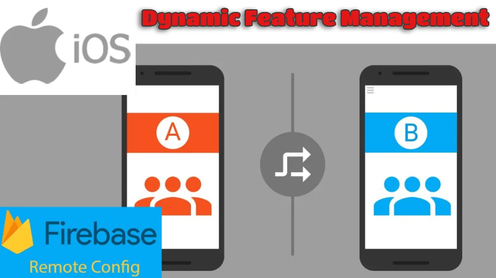

# RemoteConfigDemo
Welcome to our series on Dynamic Feature Management with Firebase Remote Config in iOS! In today’s fast-paced mobile development landscape, the ability to dynamically update and personalize app features without requiring a full app release is crucial. Typically, releasing an update to a mobile app involves an approval process, which can take several days. This delay makes it challenging to respond quickly to user feedback or market demands. Firebase Remote Configprovides a powerful and flexible solution for iOS developers to manage app behavior and appearance remotely, helping you enhance user experience and adapt to changes swiftly without waiting for a new app release. In this series, we will take you through everything you need to know about Firebase Remote Config, starting with how to integrate it into your iOS app. We’ll then dive into how to fetch and apply remote values to change features and app properties in real-time. Finally, we’ll explore advanced techniques like using user properties to target specific users and toggle features & change configurations dynamically to different users. Whether you’re a seasoned iOS developer or just starting, this series will equip you with the knowledge and tools to make your apps more responsive and engaging. Let’s get started!

## Full Medium Article
There is a medium article which has explained step by step implementation of this project.
 
[Click here to read the full article](https://medium.com/@katramesh91/getting-started-with-firebase-remote-config-in-ios-what-you-need-to-know-9ffdfe3eae8b)

  
